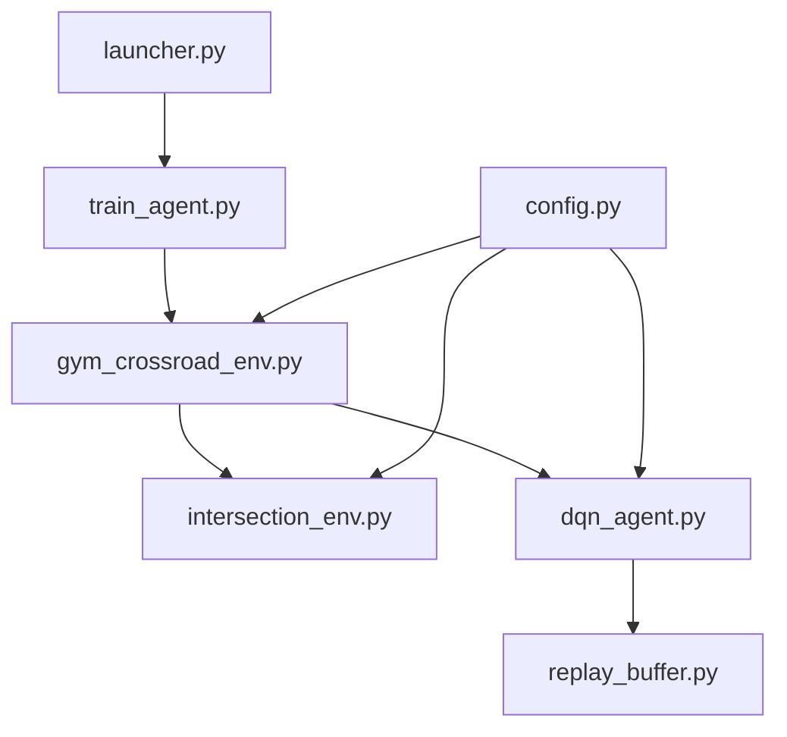

# 🏗️ Code Architecture Guide

This guide explains how the project is structured and how all the pieces work together. Perfect for developers who want to understand or modify the code.

## 📁 Project Structure

```
Cross-the-Road---RL/
├── 🚀 launcher.py              # Main entry point
├── 🎓 train_agent.py           # Training orchestration
├── 🎯 evaluate_agent.py        # Testing trained models
├── 🏋️ gym_crossroad_env.py     # RL environment wrapper
├── 🌍 intersection_env.py      # 3D simulation core
├── 🧠 dqn_agent.py            # Neural network & learning
├── 📚 replay_buffer.py        # Experience storage
├── ⚙️ config.py               # All configuration settings
├── 📋 requirements.txt        # Python dependencies
├── 📂 models/                 # Saved neural networks
└── 📖 docs/                   # Documentation
```

## 🔄 Data Flow Overview



## 🧩 Core Components

### 🚀 launcher.py - Main Interface

**Purpose**: Simplified user interface for the project

**Key Functions**:
```python
def test_simulation()     # Shows 3D environment
def train_model()         # Starts DQN training  
def run_trained_model()   # Evaluates saved model
def main()               # Interactive menu system
```

**Design Philosophy**: 
- Keep it simple for beginners
- Clear feedback and error messages
- Interactive prompts with sensible defaults

---

### 🎓 train_agent.py - Training Orchestration

**Purpose**: Coordinates the training process

**Key Functions**:
```python
def train_agent(num_episodes, max_steps, gui, save_dir)
    # 1. Create environment
    # 2. Initialize DQN agent
    # 3. Training loop with experience collection
    # 4. Model saving and progress tracking
    # 5. Performance plotting

def plot_training_progress(scores, epsilons)
    # Creates graphs showing learning progress
```

**Training Loop Structure**:
```python
for episode in range(num_episodes):
    state = env.reset()
    for step in range(max_steps):
        action = agent.act(state)           # Choose action
        next_state, reward, done = env.step(action)
        agent.step(state, action, reward, next_state, done)  # Learn
        if done:
            break
```

---

### 🏋️ gym_crossroad_env.py - RL Environment Wrapper

**Purpose**: Bridges the 3D simulation with RL standards (OpenAI Gym)

**Key Methods**:
```python
def __init__(self, gui=False)
    # Initialize PyBullet environment
    # Set up roundabout waypoints
    # Configure observation/action spaces

def _get_obs(self)
    # Return 39-dimensional observation vector:
    # [agent_pos(4), target(3), traffic_lights(4), cars(32)]

def _calculate_reward(self, action, info)
    # Complex reward system for roundabout navigation
    # Waypoint rewards + safety penalties + exploration bonuses

def step(self, action)
    # Execute action in simulation
    # Calculate rewards and check termination
    # Return (observation, reward, done, info)

def reset(self)
    # Reset agent to starting position
    # Reset waypoint progression
    # Return initial observation
```

**Enhanced Features**:
- **Roundabout Navigation**: Multi-waypoint system
- **Rich Observations**: 39-dimensional state space
- **Smart Rewards**: Progress, safety, and exploration bonuses
- **Performance Metrics**: Success rates and completion tracking

---

### 🌍 intersection_env.py - 3D Simulation Core

**Purpose**: Creates and manages the PyBullet 3D world

**Key Components**:

#### Environment Creation:
```python
def setup_environment(self)
    # Create grass base, roads, intersection
    # Add road markings and crosswalks

def create_traffic_infrastructure(self)  
    # Traffic lights with realistic positioning
    # Visual state updates (red/yellow/green)

def spawn_cars(self)
    # 8 cars in different lanes
    # Mix of rule-followers and rule-breakers
```

#### Traffic Management:
```python
def update_traffic_lights(self)
    # N-S vs E-W alternating signals
    # 5-second green, 0.5-second yellow timing

def update_cars(self)
    # Realistic car movement with collision avoidance
    # Traffic light obedience (with 25% rule-breakers)
    # Continuous car respawning
```

#### Performance Optimizations:
- Reduced physics solver iterations
- Disabled unnecessary visual features  
- Optimized collision detection
- Efficient object management

---

### 🧠 dqn_agent.py - Neural Network & Learning

**Purpose**: Implements Deep Q-Network algorithm

#### Network Architecture:
```python
class DQNNetwork(nn.Module):
    def __init__(self, state_size=39, action_size=5):
        # Input layer: 39 observations
        # Hidden layers: [256, 256, 128] 
        # Output layer: 5 actions (stay, forward, back, left, right)
```

#### Learning Algorithm:
```python
def step(self, state, action, reward, next_state, done):
    # 1. Store experience in replay buffer
    # 2. Sample batch for training (if enough experiences)
    # 3. Update Q-network every 4 steps
    # 4. Update target network every 200 steps

def learn(self, experiences):
    # 1. Calculate target Q-values using target network
    # 2. Get current Q-values from main network
    # 3. Compute loss (MSE between current and target)
    # 4. Backpropagate and update weights
    # 5. Decay epsilon (exploration rate)
```

#### Key Features:
- **Experience Replay**: Learns from stored experiences
- **Target Network**: Stable learning targets
- **Epsilon-Greedy**: Balanced exploration/exploitation
- **Gradient Clipping**: Prevents exploding gradients

---

### 📚 replay_buffer.py - Experience Storage

**Purpose**: Efficiently stores and samples training experiences

```python
class ReplayBuffer:
    def __init__(self, capacity=50000):
        self.buffer = deque(maxlen=capacity)
    
    def push(self, state, action, reward, next_state, done):
        # Store experience tuple
        
    def sample(self, batch_size):
        # Randomly sample batch for training
        # Returns: (states, actions, rewards, next_states, dones)
```

**Why Needed**: 
- Breaks correlation between consecutive experiences
- Enables efficient batch learning
- Improves sample efficiency

---

### ⚙️ config.py - Configuration Management

**Purpose**: Centralized settings for all components

#### Main Configuration Sections:

```python
ENVIRONMENT_CONFIG = {
    # Camera and visual settings
    # Road dimensions and colors
    # Intersection layout
}

CAR_CONFIG = {
    # Number of cars and spawn locations
    # Movement speeds and behaviors
    # Rule-breaking probability
}

PEDESTRIAN_CONFIG = {
    # Roundabout waypoints system
    # Visual appearance
    # Navigation tolerances
}

RL_CONFIG = {
    # DQN hyperparameters
    # Reward structure
    # Training parameters
}

SIMULATION_CONFIG = {
    # Physics settings
    # Performance optimizations
    # Graphics quality options
}
```

## 🔧 Interaction Patterns

### Training Flow:
1. **launcher.py** → calls **train_agent.py**
2. **train_agent.py** → creates **gym_crossroad_env.py** 
3. **gym_crossroad_env.py** → manages **intersection_env.py**
4. **Agent actions** → **environment responses** → **learning updates**
5. **Periodic saving** → **models/** directory

### Evaluation Flow:
1. **launcher.py** → calls **evaluate_agent.py**
2. **evaluate_agent.py** → loads saved model
3. **Model** → makes decisions in **gym_crossroad_env.py**
4. **Performance metrics** → calculated and displayed

## 🎯 Key Design Decisions

### Why PyBullet?
- **Realistic physics**: Better than 2D simulations
- **3D visualization**: More engaging and realistic
- **Performance**: Faster than other 3D engines
- **Python integration**: Easy to use with ML libraries

### Why DQN?
- **Discrete actions**: Perfect for pedestrian movement
- **Proven algorithm**: Well-established in RL
- **Sample efficiency**: Good for complex environments
- **Stability**: Works reliably with experience replay

### Why Roundabout Navigation?
- **Complex behavior**: More interesting than simple crossing
- **Real-world relevance**: Tests practical skills
- **Progressive difficulty**: Multiple waypoints create curriculum
- **Rich rewards**: Multiple objectives for better learning

## 🔍 Code Quality Features

### Error Handling:
- Graceful PyBullet disconnection
- Model loading/saving validation  
- Training interruption handling
- Clear error messages for users

### Performance Monitoring:
- Training progress visualization
- Episode statistics tracking
- Resource usage optimization
- Configurable quality settings

### Modularity:
- Clear separation of concerns
- Configurable parameters
- Easy to extend and modify
- Well-documented interfaces

## 🚀 Extension Points

Want to modify the project? Key areas to customize:

### New Behaviors:
- Modify **PEDESTRIAN_CONFIG** waypoints
- Add new reward functions in **gym_crossroad_env.py**
- Create different traffic patterns in **intersection_env.py**

### Algorithm Changes:
- Implement other RL algorithms in **dqn_agent.py**
- Modify network architecture
- Experiment with different replay strategies

### Environment Modifications:
- Add weather effects in **intersection_env.py**
- Create different intersection layouts
- Add more complex traffic scenarios

## 📚 Further Reading

For deeper understanding:

- **DQN Paper**: [Playing Atari with Deep Reinforcement Learning](https://arxiv.org/abs/1312.5602)
- **PyBullet Guide**: [PyBullet Quickstart](https://docs.google.com/document/d/10sXEhzFRSnvFcl3XxNGhnD4N2SedqwdAvK3dsihxVUA)
- **OpenAI Gym**: [Gym Documentation](https://gymnasium.farama.org/)

**Ready to customize the project? → [Advanced Configuration](05_configuration.md)**